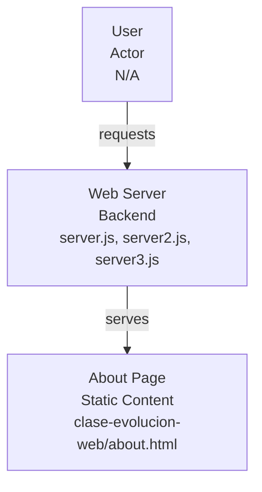
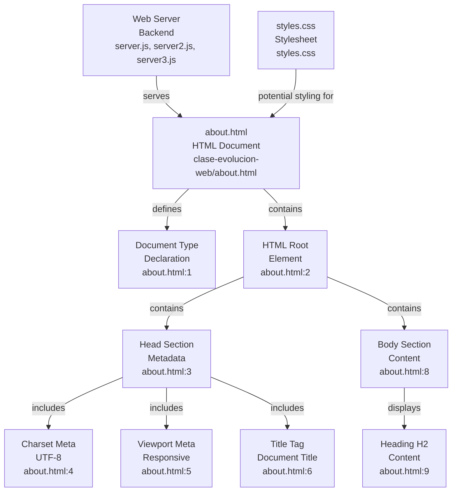

# Codebase Research Report

## Query
Investigate the "About Page" component in detail. Focus your analysis on these key files:
1. about.html (clase-evolucion-web/about.html)

Provide insights about the component's main responsibilities and functionality and how it integrates with other system components

## Answer
# About Page Component Analysis

## High-Level Architecture

The "About Page" component, primarily represented by [about.html](about.html), functions as a **static content delivery module** within the `clase-evolucion-web` project. Its main responsibility is to display pre-defined information to the user without dynamic content generation or complex client-side interactions. It integrates with the system by being served directly by a web server (likely one of the [server.js](server.js), [server2.js](server2.js), or [server3.js](server3.js) files, though the specific serving mechanism is not detailed within `about.html` itself).

## Component Details: About Page

The **About Page** component is a straightforward HTML document designed for informational display.

### Purpose

The primary purpose of the About Page is to present static content, in this case, a simple heading "Hola desde el About" (Hello from the About). It serves as a basic informational endpoint for users navigating the web application.

### Internal Parts

The internal structure of the About Page is defined by standard HTML elements:

*   **Document Type Declaration**: `<!DOCTYPE html>` [about.html](about.html:1)
*   **HTML Root Element**: `<html lang="en">` [about.html](about.html:2)
*   **Head Section**: `<head>` [about.html](about.html:3)
    *   **Character Set Meta Tag**: `<meta charset="UTF-8">` [about.html](about.html:4)
    *   **Viewport Meta Tag**: `<meta name="viewport" content="width=device-width, initial-scale=1.0">` [about.html](about.html:5)
    *   **Title Tag**: `<title>Document</title>` [about.html](about.html:6) (Note: The title is generic and could be improved for better user experience and SEO.)
*   **Body Section**: `<body>` [about.html](about.html:8)
    *   **Heading**: `<h2>Hola desde el About</h2>` [about.html](about.html:9)

### External Relationships

The `about.html` file itself does not contain any explicit client-side scripting (JavaScript) or external stylesheet links (CSS) that would define direct interactions with other client-side components or APIs. Its integration with the broader system is primarily through its role as a static resource:

*   **Served by Web Server**: It is expected to be served by a backend web server (e.g., Node.js servers like [server.js](server.js), [server2.js](server2.js), or [server3.js](server3.js)) when a user requests the `/about.html` path.
*   **Styling**: While `about.html` does not link to a stylesheet, the project contains a [styles.css](styles.css) file, suggesting that global or shared styles might be applied to this page if the server or a templating engine includes it. However, this is not directly evident from the `about.html` content.
*   **No Dynamic Content**: There are no indications of AJAX calls, form submissions, or other dynamic content fetching mechanisms within this file, meaning its content is entirely static as delivered by the server.

---
*Generated by [CodeViz.ai](https://codeviz.ai) on 7/24/2025, 9:24:18 AM*
